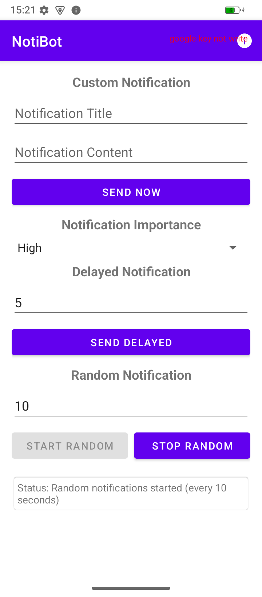

# NotiBot - Android通知测试工具

NotiBot是一个专为Android系统工程师和开发者设计的通知测试工具，提供全面的通知功能测试和调试支持。

## 🚀 功能特性

### 📱 自定义通知
- **自定义标题和内容**：可以输入任意标题和通知内容
- **多种重要性级别**：支持高重要性、默认、低重要性、静默四种级别
- **即时发送**：点击按钮立即发送通知

### ⏰ 延迟通知
- **自定义延迟时间**：支持设置任意秒数的延迟
- **后台执行**：即使应用在后台也能按时发送

### 🎲 随机通知
- **自定义间隔**：可设置通知发送间隔时间
- **随机内容**：自动生成不同的标题和内容
- **持续运行**：支持长时间连续发送
- **状态保持**：应用重启后保持随机通知状态

### 🔧 系统集成
- **前台服务**：确保后台持续运行
- **通知渠道**：完整支持Android通知渠道
- **权限管理**：自动申请必要权限
- **电池优化豁免**：避免被系统杀死

## 📋 系统要求

- **Android版本**：Android 11+ (API 30+)
- **权限需求**：
  - 通知权限 (POST_NOTIFICATIONS)
  - 前台服务权限 (FOREGROUND_SERVICE)
  - 电池优化豁免权限
  - 精确定时权限 (SCHEDULE_EXACT_ALARM)

## 🛠 安装说明

1. 下载最新版本的APK文件
2. 在Android设备上启用"未知来源安装"
3. 安装APK文件
4. 首次启动时授予必要权限

## 📖 使用指南

### 基础操作

1. **发送即时通知**
   - 输入标题和内容（可选）
   - 选择通知重要性级别
   - 点击"SEND NOW"按钮

2. **发送延迟通知**
   - 设置延迟时间（秒）
   - 输入通知内容
   - 点击"SEND DELAYED"按钮

3. **启动随机通知**
   - 设置发送间隔时间
   - 点击"START RANDOM"开始
   - 点击"STOP RANDOM"停止

### 通知重要性说明

- **High（高重要性）**：带声音和浮动通知，会在屏幕顶部显示
- **Default（默认）**：标准通知，有声音提示
- **Low（低重要性）**：静音通知，仅在通知栏显示
- **Silent（静默）**：完全静默，不会打扰用户

## 🌍 多语言支持

NotiBot支持以下语言：
- 🇺🇸 English (英语)
- 🇨🇳 简体中文

应用会根据系统语言设置自动切换界面语言。

## 📊 应用信息

在应用右上角点击信息图标可查看：
- 应用版本信息
- 构建时间
- 开发者信息

## ⚠️ 注意事项

1. **电池优化**：为确保后台正常运行，请将应用加入电池优化白名单
2. **自启动权限**：某些设备需要手动开启自启动权限
3. **通知权限**：Android 13+需要手动授予通知权限
4. **后台限制**：部分厂商ROM可能对后台应用有额外限制

## 🔧 技术实现

### 架构特点
- **MVVM架构**：清晰的代码结构
- **ViewBinding**：类型安全的视图绑定
- **前台服务**：保证后台稳定运行
- **SharedPreferences**：状态持久化存储

### 核心组件
- `MainActivity`：主界面和用户交互
- `NotificationService`：后台通知服务
- `NotificationChannel`：通知渠道管理

## 📱 测试场景

NotiBot特别适用于以下测试场景：

1. **通知系统测试**：验证不同重要性级别的通知表现
2. **后台服务测试**：测试应用在后台的运行稳定性
3. **权限测试**：测试通知权限的申请和使用
4. **系统集成测试**：验证与Android系统的兼容性
5. **用户体验测试**：测试通知对用户的干扰程度

## 👨‍💻 开发者

**@TheDeathDragon**

## 📄 许可证

本项目仅供学习和测试使用。

---

**NotiBot** - 让通知测试变得简单！